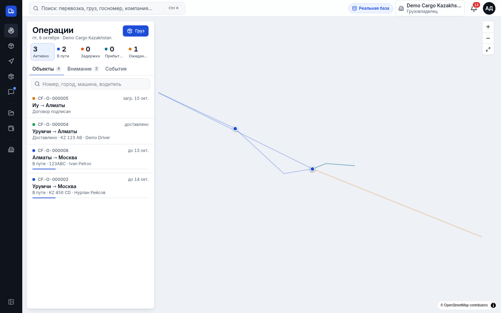
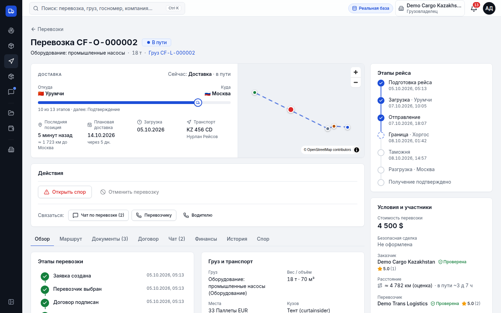
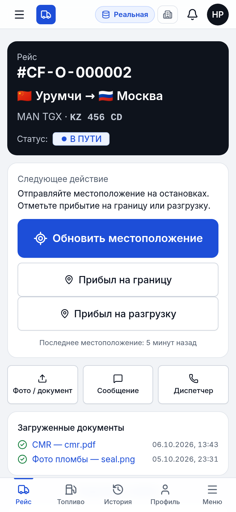
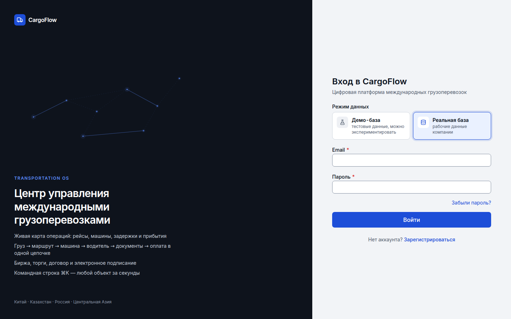
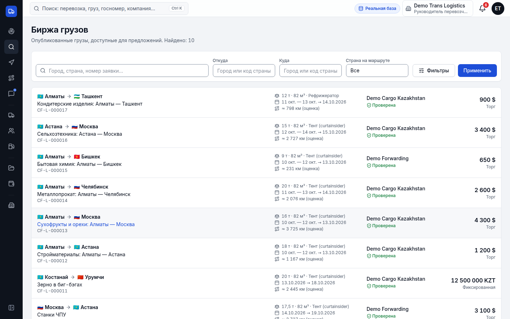
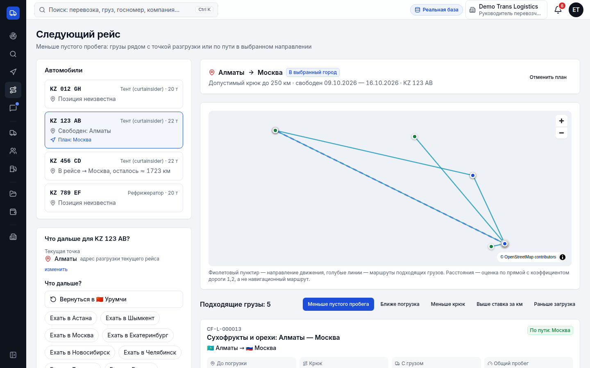
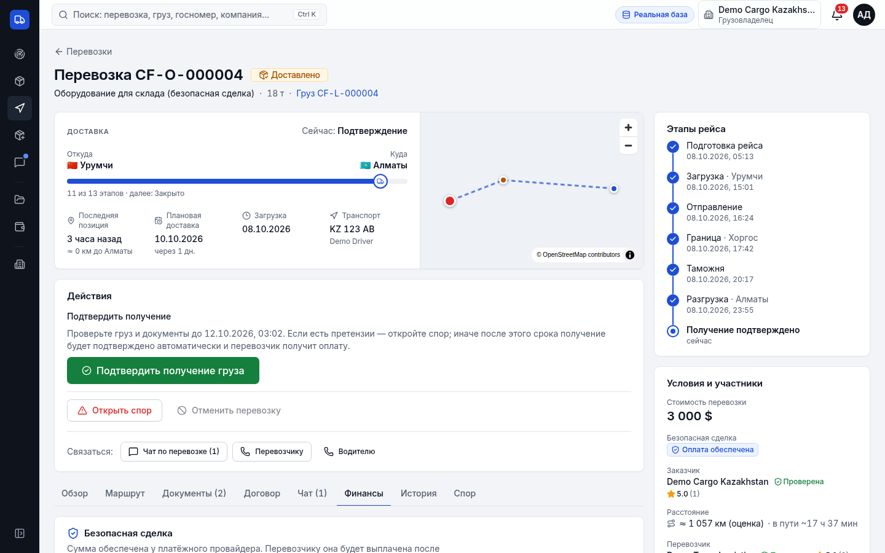
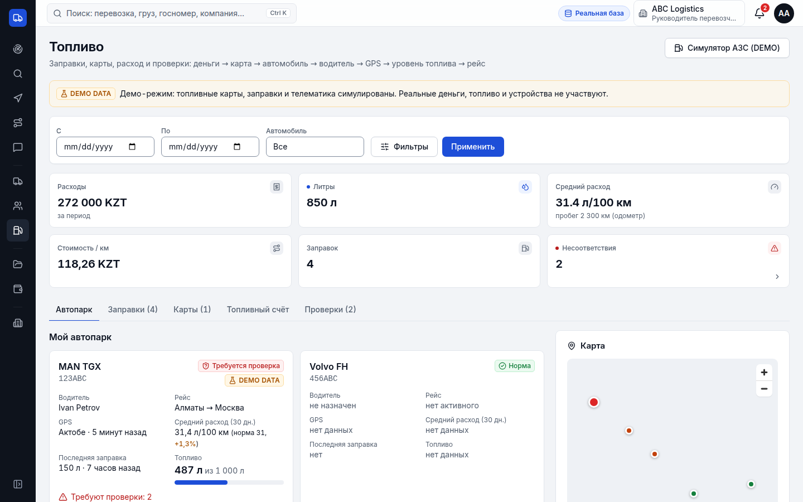
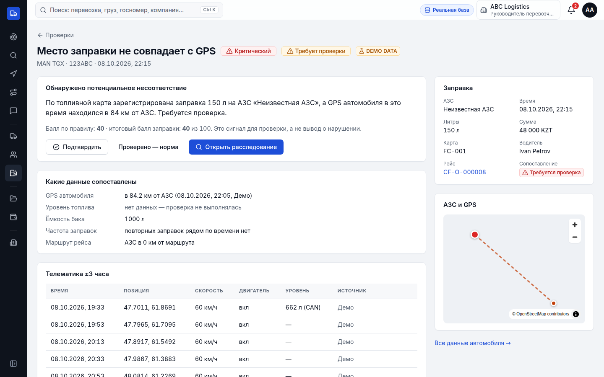
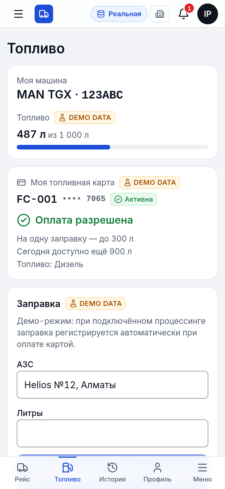

# CargoFlow

**CargoFlow** — SaaS-платформа для цифровизации международных автомобильных грузоперевозок (Китай — Казахстан — Центральная Азия — Россия и любые другие страны).

В одном месте участники перевозки:

**создают груз → публикуют на бирже → получают ставки и торгуются → выбирают перевозчика → формируют договор и подписывают его электронно → назначают автомобиль и водителя → водитель ведёт рейс из мобильного интерфейса (статусы, фото, геолокация) → документы, чат, финансы → доставка с POD → подтверждение получения → закрытие сделки → отзывы.**

Это рабочий MVP, а не прототип: все действия идут через backend, хранятся в PostgreSQL, проверяются по правам на сервере и пишутся в журнал аудита.

---

## 🚀 Быстрый старт (локально, в один клик)

Docker и ручная установка PostgreSQL **не нужны**: скрипт сам поставит Node.js (если его нет), зависимости и встроенный PostgreSQL 16, загрузит демо-данные и откроет браузер.

1. Скачайте проект: на GitHub нажмите **Code → Download ZIP** и распакуйте (или `git clone`).
2. Запустите файл двойным кликом:
   - **Windows:** `start-windows.bat`
   - **macOS:** `start-mac.command` (если macOS блокирует: правый клик → «Открыть»)
   - **Linux:** `bash start-linux.sh`
3. Первый запуск займёт 2–5 минут. Откроется http://localhost:3000.
   Вход: `shipper@cargoflow.demo` / `Demo1234!` (на странице входа есть кнопки для всех ролей).

Повторные запуски — тот же файл (быстро, данные сохраняются в `.local/pgdata`). Остановка — `Ctrl+C` в окне терминала.

Через терминал то же самое: `npm install && npm run setup && npm run local`.

## Скриншоты

| Операции (карта и список)             | Перевозка                         | Водитель (mobile)                         |
| ------------------------------------- | --------------------------------- | ----------------------------------------- |
|  |  |  |

| Вход                              | Биржа грузов                            |
| --------------------------------- | --------------------------------------- |
|  |  |

| Следующий рейс (Next Load)            | Безопасная сделка (Secure Deal)         |
| ------------------------------------- | --------------------------------------- |
|  |  |

| Топливо: сводка автопарка        | Проверка заправки (несоответствие)       | Водитель: топливо (mobile)               |
| -------------------------------- | ---------------------------------------- | ---------------------------------------- |
|  |  |  |

<sub>Скриншоты сняты на локальных демо-данных (`npm run db:seed`) без подложки карты: среда съёмки не имела доступа к тайлам. С `NEXT_PUBLIC_GEOAPIFY_KEY` под маршрутами отображается карта.</sub>

## 1. Что такое CargoFlow

| Роль                                           | Что делает                                                                                                                                                     |
| ---------------------------------------------- | -------------------------------------------------------------------------------------------------------------------------------------------------------------- |
| **Грузовладелец** (`SHIPPER`)                  | создаёт и публикует грузы, сравнивает ставки, торгуется, принимает предложение, подписывает договор, следит за рейсом, подтверждает получение, оставляет отзыв |
| **Руководитель перевозчика** (`CARRIER_ADMIN`) | биржа грузов, ставки, подписание договора, автопарк, водители, назначения, документы, финансы, сотрудники                                                      |
| **Диспетчер** (`CARRIER_DISPATCHER`)           | то же, что руководитель, кроме настроек компании, управления сотрудниками, подписи договора и редактирования финансов                                          |
| **Экспедитор** (`FORWARDER`)                   | создаёт грузы от имени клиента, выбирает перевозчиков, контролирует много перевозок одновременно                                                               |
| **Водитель** (`DRIVER`)                        | упрощённый мобильный экран «Мой рейс»: одна большая кнопка для следующего шага, фото, CMR, геолокация, чат                                                     |
| **Администратор** (`PLATFORM_ADMIN`)           | пользователи, компании, верификация, споры, безопасные сделки (выплаты/возвраты), журнал аудита, настройки платформы                                           |

### Нативные приложения

- **CargoFlow** (Windows, macOS, iOS, Android) — для грузовладельцев, перевозчиков и экспедиторов: живая карта операций, перевозки, грузы, биржа, автопарк, события.
- **CargoFlow Водитель** (iOS, Android) — рейс, следующий шаг одной кнопкой, фоновая геолокация, фото и CMR с камеры, офлайн-очередь.

Flutter, полноценный нативный интерфейс (не WebView), тот же API. Код — `native/`, описание и сборка — [docs/NATIVE_APPS.md](docs/NATIVE_APPS.md).

## 2. Tech stack

- **Next.js 16** (App Router, Server Components, Route Handlers, Turbopack), **React 19**, **TypeScript**
- **PostgreSQL 16** + **Prisma 7** (driver adapter `@prisma/adapter-pg`), миграции с ручными частичными уникальными индексами и CHECK-ограничениями
- **Tailwind CSS 4** + компоненты в стиле **shadcn/ui** на **Radix UI**, **lucide-react**, **sonner**
- **Zod 4** (общие схемы для форм и сервера), **React Hook Form**
- **MapLibre GL** (open-source; стиль/тайлы настраиваются), **pdf-lib** (PDF договоров с кириллицей, шрифт DejaVu Sans)
- Хранилище файлов: локальная ФС (dev) или любое **S3-совместимое** (MinIO, AWS S3 и др.)
- Тесты: **Vitest** (unit + integration на реальной БД), **Playwright** (E2E)
- ESLint, Prettier, Docker Compose

## 3. Requirements

- Node.js **20.9+** (рекомендуется 22 LTS), npm 10+
- PostgreSQL **16** (локально или через Docker)
- Для E2E: Chromium для Playwright (`npx playwright install chromium` или путь к существующему через `PLAYWRIGHT_CHROMIUM_PATH`)

## 4. Installation

```bash
git clone <repo> cargoflow && cd cargoflow
cp .env.example .env            # при необходимости поправьте значения
docker compose up -d            # PostgreSQL (+ БД cargoflow_test) и MinIO
npm install                     # postinstall выполнит prisma generate
npm run db:migrate:all          # миграции реальной и демо-базы (схема cargoflow_demo)
npm run db:seed                 # сценарии в реальной базе разработки (ОЧИЩАЕТ её!)
npm run seed:demo               # демо-база: ≈100 грузов, 20 машин, 40 клиентов (только DEMO)
npm run dev                     # http://localhost:3000
```

## 5. Environment variables

Все переменные описаны в `.env.example`. Главные:

| Переменная                                 | Назначение                                                                                                                                                                                                                                       |
| ------------------------------------------ | ------------------------------------------------------------------------------------------------------------------------------------------------------------------------------------------------------------------------------------------------ |
| `DATABASE_URL`                             | строка подключения PostgreSQL                                                                                                                                                                                                                    |
| `DEMO_DATABASE_URL`                        | демо-база (режим «🧪 Демо-база» при входе); пусто — та же СУБД, схема `cargoflow_demo`. Подробно — [docs/DATABASE_MODES.md](docs/DATABASE_MODES.md)                                                                                              |
| `TEST_DATABASE_URL`                        | **отдельная** БД для integration/E2E тестов (она очищается!)                                                                                                                                                                                     |
| `APP_URL`                                  | публичный URL приложения (ссылки в письмах, проверка Origin)                                                                                                                                                                                     |
| `APP_SECRET`                               | зарезервировано для будущих подписанных ссылок (сейчас не используется)                                                                                                                                                                          |
| `TRUSTED_PROXY_HOPS`                       | число доверенных прокси перед приложением (IP клиента из `X-Forwarded-For` для rate limit и аудита), по умолчанию 1                                                                                                                              |
| `SESSION_TTL_DAYS`                         | срок жизни сессии                                                                                                                                                                                                                                |
| `STORAGE_DRIVER`                           | `local` или `s3`; для `s3` — `S3_ENDPOINT`, `S3_BUCKET`, `S3_ACCESS_KEY_ID`, `S3_SECRET_ACCESS_KEY`, `S3_REGION`, `S3_FORCE_PATH_STYLE`                                                                                                          |
| `MAX_UPLOAD_MB`                            | лимит размера файла (по умолчанию 15)                                                                                                                                                                                                            |
| `EMAIL_DRIVER`                             | `log` — письма пишутся в лог сервера (в production токены и адреса маскируются); `none` — отключено                                                                                                                                              |
| `TELEGRAM_BOT_TOKEN`, `WHATSAPP_API_TOKEN` | необязательные адаптеры уведомлений (для локального запуска не нужны)                                                                                                                                                                            |
| `GEOAPIFY_API_KEY`                         | серверный ключ Geoapify: маршрут грузовика по дорогам (километраж, время в пути, линия на карте) и геокодирование адресов/городов вне справочника. Пусто — справочник городов и оценка «по прямой × 1.2» с пометкой «оценка»                     |
| `NEXT_PUBLIC_GEOAPIFY_KEY`                 | публичный ключ Geoapify для подложки карт (стиль «positron»; ограничьте ключ доменом). Встраивается при сборке. Пусто — тайлы OpenStreetMap, только для разработки                                                                               |
| `NEXT_PUBLIC_MAP_STYLE_URL`                | свой стиль MapLibre — приоритетнее `NEXT_PUBLIC_GEOAPIFY_KEY`                                                                                                                                                                                    |
| `PAYMENT_PROVIDER`                         | платёжный провайдер безопасной сделки: `sandbox` (тест, деньги не движутся; в production только с `ALLOW_SANDBOX_PAYMENTS=1` или на демо-стенде) или `manual` (подтверждение администратором); пусто — sandbox в разработке, manual в production |
| `PAYMENT_WEBHOOK_SECRET`                   | секрет HMAC для webhook провайдера `POST /api/payments/webhooks/:provider`; пусто — webhook отключён                                                                                                                                             |
| `CRON_SECRET`                              | ключ внешнего вызова плановой задачи `POST /api/system/jobs/secure-deal`                                                                                                                                                                         |
| `JOB_SECURE_DEAL_INTERVAL_MIN`             | встроенный планировщик задачи (автоподтверждение, повтор выплат и зависших операций, решения по спорам, обслуживание БД); по умолчанию 10 мин в production, `0` — выключен                                                                       |
| `FUEL_CARD_PROVIDER`                       | провайдер топливных карт: `demo` — симулятор (все операции помечены DEMO DATA)                                                                                                                                                                   |
| `FUEL_CARD_WEBHOOK_SECRET`                 | секрет HMAC для `POST /api/integrations/fuel-cards/:provider/webhook`; пусто — webhook отключён                                                                                                                                                  |
| `TELEMATICS_WEBHOOK_SECRET`                | секрет HMAC для `POST /api/integrations/telematics/:provider/ingest` (CAN, датчик уровня, GPS); пусто — приём отключён                                                                                                                           |
| `DEMO_SEED`                                | `1` — демо-стенд: при старте контейнера загрузить демо-базу, если она пуста (пишет только в DEMO; реальная база не трогается); регистрация на стенде закрыта (`ALLOW_PUBLIC_REGISTRATION=1` — открыть)                                           |
| `DEMO_ADMIN_PASSWORD`                      | пароль демо-администратора в production (≥ 12 символов); не задан — случайный, нигде не выводится                                                                                                                                                |
| `NEXT_PUBLIC_SHOW_DEMO`                    | `1` — кнопки демо-аккаунтов на странице входа в production (встраивается при сборке)                                                                                                                                                             |

Секреты в репозиторий не коммитятся (`.env*` в `.gitignore`, кроме `.env.example`).

## 6. PostgreSQL setup

Через Docker: `docker compose up -d postgres` — создаёт `cargoflow` и `cargoflow_test` (`docker/postgres-init.sql`).

Без Docker:

```sql
CREATE DATABASE cargoflow;
CREATE DATABASE cargoflow_test;
```

## 7. Prisma migration

```bash
npm run db:deploy     # применить миграции (prod/CI)
npm run db:migrate    # создать новую миграцию при изменении schema.prisma (dev)
npm run db:generate   # сгенерировать клиент (src/generated/prisma)
```

Миграция `prisma/migrations/*_init` дополнительно содержит то, что Prisma не выражает в схеме:
последовательности для номеров `CF-L/CF-O/CF-C`, частичные уникальные индексы (одна активная ставка перевозчика на груз, **одна принятая ставка на груз**, одна действующая подпись компании на версии договора, одна активная версия документа, один открытый спор на заказ) и CHECK-ограничения (вес > 0, цена ≥ 0, дата загрузки ≤ даты доставки, рейтинг 1–5 и др.). Уникальность `TransportOrder.loadId` гарантирует «один груз → одна сделка».

## 8. Seed

```bash
npm run db:seed        # или: npm run db:reset (сброс миграций + seed)
```

Seed **очищает базу** и проводит сделки **через настоящий сервисный слой** (транзакции, state machine, договоры с hash, аудит, уведомления), после чего переносит их в прошлое с правдоподобной хронологией (торги и договор → загрузка → рейс до плановой доставки → подтверждение). Создаются: 5 компаний (включая автопарк ABC Logistics для модуля топлива), демо-пользователи, автопарк, водители, 19 грузов (опубликованные, в торгах, черновик, для Next Load), 8 перевозок во всех ключевых состояниях: закрытые (с отзывами и выплатой), в пути (с трекингом, документами и чатом), доставленная с резервом оплаты, с подписанным договором, ожидающая подписи (с историей торга), со спором. Все данные вымышлены.

Seed отказывается очищать базу, в которой есть пользователи не из демо-домена (`SEED_FORCE=1` — осознанно разрешить, например для тестовой базы).

## 9. Run development

```bash
npm run dev      # http://localhost:3000
```

Письма (сброс пароля, приглашения, уведомления) в dev выводятся в лог сервера как JSON-строки `email.dev`.

## 10. Run tests

```bash
npm run test:unit          # unit-тесты: валидация, права, state machine заказа, платежа и топливной транзакции, комиссия, условия выплаты, подбор Next Load, финансы, hash, часовые пояса, лимиты топливных карт, правила несоответствий, расход
npm run test:integration   # integration-тесты на TEST_DATABASE_URL: core flow, безопасная сделка (резерв, выплата, двойная выплата, таймаут, спор, частичная выплата, возврат, отказ провайдера, webhook, права), Next Load, RBAC, конкурентность, топливо (карты, лимиты, блокировка, дубликат ID провайдера, возврат/отмена, сопоставление с уровнем и GPS, бак, расследования, изоляция водителей и компаний)
npm test                   # unit + integration
npm run test:e2e           # сборка + Playwright: полный сценарий, безопасная сделка → выплата → закрытие → следующий рейс, топливо (сводка → проверка → расследование, водитель без баланса), RBAC/CSRF по HTTP
```

E2E поднимает `next start` на порту 3100 против `TEST_DATABASE_URL`, предварительно применяя миграции и seed. Если браузер Playwright не установлен:

```bash
PLAYWRIGHT_CHROMIUM_PATH=/path/to/chromium npm run test:e2e
```

## 11. Run build

```bash
npm run lint && npm run typecheck
npm run build && npm start
```

## 12. Production deployment

1. PostgreSQL 16 (managed), S3-совместимое хранилище с **приватным** bucket.
2. Переменные: `NODE_ENV=production`, `APP_URL=https://…` (cookie получают флаг `Secure`), сильный `APP_SECRET`, `STORAGE_DRIVER=s3` + `S3_*`, `EMAIL_DRIVER` по готовности адаптера.
3. `npm ci && npm run build`, затем при каждом релизе `npm run db:deploy`, запуск `npm start` за HTTPS-прокси (передающим `X-Forwarded-For`).
4. Либо `Dockerfile` (выполняет `prisma migrate deploy` при старте).
5. **Не запускайте seed в production** (он очищает БД; скрипт это блокирует).
6. Rate limiter в MVP хранится в памяти процесса — при нескольких инстансах замените реализацию `RateLimiter` на Redis (интерфейс в `src/lib/auth/rate-limit.ts`). Укажите `TRUSTED_PROXY_HOPS` по числу прокси перед приложением.
7. Плановая задача безопасной сделки запускается встроенным планировщиком (`JOB_SECURE_DEAL_INTERVAL_MIN`) или внешним cron с `CRON_SECRET`. Задача идемпотентна — параллельные запуски на нескольких инстансах безопасны.
8. При старте в production сервер предупреждает в логе об опасных настройках (локальное хранилище файлов, e-mail только в лог, отсутствие https в `APP_URL`).
9. Заголовки безопасности: CSP, HSTS (production), `X-Frame-Options`, `nosniff`; пользовательские файлы отдаются с `CSP: sandbox`.
10. CI: `.github/workflows/ci.yml` — lint, typecheck, prettier, unit, integration на PostgreSQL, проверка соответствия миграций схеме, сборка.

## 13. Demo accounts

Пароль для всех: **`Demo1234!`** (только локальная среда; на странице входа есть кнопки быстрого заполнения).

| Роль                              | Email                       | Компания                |
| --------------------------------- | --------------------------- | ----------------------- |
| Грузовладелец                     | `shipper@cargoflow.demo`    | Demo Cargo Kazakhstan   |
| Перевозчик (руководитель)         | `carrier@cargoflow.demo`    | Demo Trans Logistics    |
| Диспетчер                         | `dispatcher@cargoflow.demo` | Demo Trans Logistics    |
| Экспедитор                        | `forwarder@cargoflow.demo`  | Demo Forwarding         |
| Водитель (доставил груз в Алматы) | `driver@cargoflow.demo`     | Demo Trans Logistics    |
| Водитель (сейчас в рейсе)         | `driver2@cargoflow.demo`    | Demo Trans Logistics    |
| Второй перевозчик (на проверке)   | `carrier2@cargoflow.demo`   | Demo Silk Road Carriers |
| Автопарк: руководитель (топливо)  | `fleet@cargoflow.demo`      | ABC Logistics           |
| Водитель Ivan (топливная карта)   | `ivan@cargoflow.demo`       | ABC Logistics           |
| Администратор                     | `admin@cargoflow.demo`      | —                       |

### Демо-сценарий «с нуля» (как в E2E)

1. `shipper@…` → «Создать груз»: Китай (Урумчи) → Алматы → Москва, 20 000 кг, тент, 4 500 USD → «Опубликовать груз».
2. `carrier@…` → «Биржа грузов» → груз → «Предложить цену» 4 200 USD.
3. `shipper@…` → уведомление → вкладка «Предложения» → «Принять предложение» → создаются перевозка и договор.
4. Обе стороны: вкладка «Договор» → галочка согласия + пароль → «Подписать документ».
5. `carrier@…` → «Назначить автомобиль» (Volvo FH, KZ 123 AB) → «Назначить водителя» (Demo Driver).
6. `driver@…` (удобно с телефона) → «Мой рейс»: Я прибыл на загрузку → фото → Груз загружен → Начать перевозку → Обновить местоположение → Прибыл на границу → таможня → Граница пройдена → Продолжить маршрут → Прибыл на разгрузку → «Груз доставлен» (приложить CMR/POD).
7. `shipper@…` → «Подтвердить получение груза» → перевозка **закрыта**, сформирован окончательный расчёт → «Оставить отзыв»; перевозчик тоже оставляет отзыв.

### Демо: безопасная сделка и следующий рейс

Seed создаёт сценарий из ТЗ (комиссия платформы в демо — 2%):

| Перевозка     | Маршрут         | Сумма  | Состояние                                                               |
| ------------- | --------------- | ------ | ----------------------------------------------------------------------- |
| `CF-O-000003` | Урумчи → Алматы | $3 000 | закрыта, **PAYMENT_RELEASED** (перевозчику $2 940, комиссия $60)        |
| `CF-O-000004` | Урумчи → Алматы | $3 000 | доставлено, POD загружен, **PAYMENT_RESERVED**, идёт срок проверки 72 ч |
| `CF-O-000007` | Алматы → Урумчи | $2 700 | спор (задержка), **PAYMENT_DISPUTED** — выплата заморожена              |

1. `shipper@…` → `CF-O-000004` → «Финансы»: сумма, комиссия, условия выплаты, срок проверки → «Подтвердить получение груза» → `PAYMENT_RELEASE_PENDING` → `PAYMENT_RELEASED` → перевозка **закрыта** системой.
2. `driver@…` → «Мой рейс» → «Что планируете дальше?» → например «В Астана».
3. `carrier@…` → «Главная» → карточка «Следующий рейс» → «Следующий рейс»: автомобиль KZ 123 AB свободен в Алматы. На бирже — грузы Алматы → Астана, Алматы → Москва, Алматы → Челябинск, Алматы → Бишкек, Астана → Москва и рефрижераторный Алматы → Ташкент. Меняйте направление и смотрите, как меняется подбор:
   - **Москва** — прямой груз в Москву первым, затем Бишкек, Челябинск, Астана и Астана → Москва (погрузка по пути); рефрижераторный груз исключён по кузову;
   - **Астана** — только Алматы → Астана (Москва/Челябинск — «крюк», Бишкек — «в сторону от направления»);
   - **Пока не знаю** — все грузы с погрузкой в радиусе 300 км от Алматы.
4. `admin@…` → «Безопасные сделки»: список, операции, «Обработать истёкшие сроки»; в перевозке со спором — решение по деньгам (выплатить / вернуть / разделить).

## Fleet Fuel Control / Топливо автопарка

**Цепочка:** деньги → топливная карта → автомобиль → водитель → GPS → уровень топлива → рейс → проверка.
Модуль встроен в существующие сущности (компания, автомобиль, водитель, перевозка, уведомления, аудит, хранилище, карта) — параллельной архитектуры нет.

**Принципы**

- CargoFlow **не банк и не хранит данные карт**: ни номера, ни PIN, ни CVV. В базе — только токен провайдера (`providerCardId`, наружу не отдаётся) и последние 4 цифры. Деньги на топливном счёте (`FuelAccount`) — учёт в журнале `FuelAccountEntry` (append-only, суммы в минимальных единицах, `balance ≥ 0`, `0 ≤ reserved ≤ balance` — CHECK в БД).
- Все лимиты и права проверяются **на сервере**. Водитель не видит баланс компании и суммы — только «Оплата разрешена / не разрешена», остаток литров на сегодня и (если разрешено) уровень в баке.
- Несоответствие — **сигнал для проверки, а не обвинение**: тексты нейтральные («Обнаружено потенциальное несоответствие… Требуется проверка»), решение принимает владелец.
- Демо-данные и симулятор АЗС всегда помечены **DEMO DATA**. Если данных нет — показывается «нет данных», а не выдуманные цифры.

**Модели:** `FuelAccount`, `FuelAccountEntry`, `FuelCard`, `FuelTransaction`, `TelemetryReading`, `FuelAnomaly`, `FuelInvestigation` (+ комментарии, вложения, связанные заправки). У `Vehicle` добавлены тип топлива, объём бака, норма л/100 км, телематическое устройство.

**Топливная карта:** выпуск (метка `FC-001`, привязка к машине/водителю), блокировка/разблокировка/утеря, лимиты: литры на заправку/день/месяц, сумма в день/месяц, виды топлива, сети АЗС, страны, окно времени (в т.ч. через полночь, в часовом поясе карты). Каждое изменение — в `AuditLog`, водитель получает уведомление.

**Транзакция:** `PENDING → AUTHORIZED → APPROVED → COMPLETED` / `DECLINED`, `REVERSED`, `REFUNDED`, `DISPUTED`. Авторизация блокирует карту и счёт (`SELECT … FOR UPDATE`), проверяет лимиты по уже учтённым операциям, резервирует сумму. Уникальность `(provider, providerTransactionId)` — повтор события провайдера возвращает ту же транзакцию, двойного списания нет. Завершённые транзакции неизменяемы: исправление — только возврат/отмена/спор. Заправка автоматически привязывается к активному рейсу автомобиля.

**Телематика:** `TelemetryReading` — позиция, скорость, двигатель, одометр, уровень топлива, счётчик расхода CAN. Каждый параметр либо есть, либо `NOT_AVAILABLE`. Источник уровня (`CAN_J1939` / `FUEL_SENSOR`) хранится с каждой отметкой; в одном расчёте источники не смешиваются (датчик приоритетнее). Если телематики нет, для GPS используется трекинг водителя из приложения (с пометкой источника).

**Проверка заправки** (`src/lib/fuel/anomaly-rules.ts`, чистые функции, покрыты тестами):

| Правило                  | Условие                                                                  | Балл |
| ------------------------ | ------------------------------------------------------------------------ | ---- |
| `LOCATION_MISMATCH`      | GPS ±30 мин от заправки дальше 5 км от АЗС                               | +40  |
| `TANK_CAPACITY_EXCEEDED` | уровень до заправки + литры > объём бака (+3%)                           | +40  |
| `FUEL_LEVEL_MISMATCH`    | прирост уровня ±2 ч отличается от литров больше чем на max(15 л, 5%)     | +30  |
| `UNEXPECTED_FUEL_DROP`   | падение уровня > max(20 л, 3% бака) при выключенном двигателе на стоянке | +35  |
| `FREQUENT_REFUELING`     | повторная заправка той же машины в течение 2 ч                           | +15  |
| `ROUTE_DEVIATION`        | АЗС дальше 30 км от маршрута рейса                                       | +15  |

Итог 0–100 (0–20 низкий, 21–50 средний, 51–80 высокий, 81–100 критический риск), с перечнем причин и сопоставленных данных. Статус сопоставления: `MATCHED`, `PARTIALLY_VERIFIED`, `UNVERIFIED` (нет данных), `MISMATCH`. Поздно пришедшая телеметрия перепроверяет заправки; несоответствие, которое перестало воспроизводиться, закрывается автоматически. О высоких/критических — уведомление владельцу с действиями «Посмотреть / Подтвердить / Открыть расследование».

**Расход:** л/100 км за рейс/день/месяц — по счётчику CAN, иначе по балансу уровня, иначе по покупкам; пробег — по одометру, иначе оценка по маршруту (метод всегда подписан). Отклонение от нормы автомобиля, стоимость км.

**Расследование:** `OPEN → UNDER_REVIEW → RESOLVED / DISMISSED`, заправки, GPS и уровень на одной странице, комментарии, документы и фото (через хранилище проекта), решение обязательно при закрытии.

**Страницы:** `/fuel` (KPI, фильтры: период, машина, водитель, топливо, АЗС, статус, сопоставление; автопарк, карта заправок, заправки, карты, счёт, проверки), `/fuel/vehicles/:id` (бак, график уровня, расход против нормы, заправки, телематика), `/fuel/anomalies/:id`, `/fuel/investigations/:id`, вкладка «Топливо» в перевозке (отчёт по рейсу), `/driver/fuel` (минимальный вид водителя), `/admin/fuel` (проверки по всем компаниям и статус интеграций).

**Права:** `FUEL_VIEW`/`FUEL_INVESTIGATE` — руководитель и диспетчер перевозчика; `FUEL_MANAGE` (карты, лимиты, счёт, настройки) и `FUEL_FINANCE_VIEW` (суммы) — только руководитель; `FUEL_DRIVER` — водитель (только своя карта и свои заправки); администратор — всё. Диспетчер видит литры, но не деньги.

**API:** `GET /api/fuel/dashboard`, `/api/fuel/fleet`, `GET|PATCH /api/fuel/vehicles/:id`, `/api/fuel/vehicles/:id/telemetry`, `GET|POST /api/fuel/accounts` (пополнение, `Idempotency-Key`), `GET|POST /api/fuel/cards`, `/api/fuel/cards/:id/{status,limits,assign}`, `GET|POST /api/fuel/transactions` (симулятор, demo), `/api/fuel/transactions/:id[/action]`, `/api/fuel/anomalies[/:id[/review]]`, `/api/fuel/investigations[/:id[/comments|attachments|transactions]]`, `/api/orders/:id/fuel`, `GET|POST /api/driver/fuel`, webhooks `POST /api/integrations/fuel-cards/:provider/webhook` и `POST /api/integrations/telematics/:provider/ingest` (HMAC-SHA256).

**Демо (seed):** `fleet@cargoflow.demo` — ABC Logistics, MAN TGX `123ABC` (бак 1 000 л, норма 31 л/100 км, демо-CAN), водитель Ivan (`ivan@cargoflow.demo`), рейс Алматы → Москва, карта `FC-001` (300 л за заправку), 4 заправки на 850 л (250 + 300 + 150 + 150), уровень сейчас 487 л, 2 потенциальных несоответствия: уровень вырос на 24 л при заправке 150 л и АЗС в 84 км от GPS.

## Next Load / Следующий рейс

**Задача:** после доставки перевозчик не должен ехать порожняком и не обязан возвращаться в исходную точку.

- **План движения** (`PlannedMovement`): текущая точка (последняя отметка водителя или адрес разгрузки, можно изменить), что дальше — _вернуться обратно_, _в выбранный город(а)_, _направление на карте_, _пока не определился_; можно указать до 5 направлений. Параметры: допустимый крюк (км), радиус поиска (км), период доступности. Один активный план на автомобиль (частичный уникальный индекс); назначение автомобиля на новый рейс помечает план выполненным.
- **Подбор** (`src/lib/next-load/matching.ts`, чистая функция, покрыта unit-тестами) — без «магического» рейтинга:
  1. совместимость: грузоподъёмность, объём, тип кузова (рефрижератор может везти изотерм), GPS;
  2. время: успевает ли машина к окну погрузки (оценка 600 км/сутки), попадает ли погрузка в период доступности;
  3. геометрия — **коридор движения**: путь «текущая точка → погрузка → выгрузка → направление» длиннее прямого не более чем на допустимый крюк, и не меньше половины пробега с грузом приближает к цели. На длинных маршрутах коридор естественно шире в середине, поэтому подходят и грузы с погрузкой по пути (Астана → Челябинск, Костанай → Москва по пути Алматы → Москва). Без направления — радиус вокруг текущей точки.
- **Результат** (`NextLoadMatch`, вычисляется на лету): расстояние до погрузки, крюк, отклонение от линии направления, пустой пробег, пробег с грузом, общий пробег, остаток до цели, доля движения «по направлению», цена и ставка за км, дата погрузки, прибытие, понятные причины «почему подходит». Для неподошедших грузов показываются причины отсева.
- **Сортировки:** меньше пустого пробега (пустой пробег + крюк), ближе погрузка, меньше крюк, выше ставка за км, раньше загрузка.
- **Заранее, пока рейс идёт:** dashboard перевозчика показывает «Через ≈ 120 км вы будете в г. Алматы. Найдено 4 подходящих груза в направлении Москва». Водитель после разгрузки указывает направление в приложении — диспетчер получает уведомление; водитель видит грузы без цен.
- **Непрерывная загрузка:** после выгрузки (`DELIVERED`) автомобиль освобождается сразу, не дожидаясь закрытия финансовой части — его можно назначить на следующий груз.
- Расстояния — оценка по прямой × 1,2 (не навигационный маршрут). Для точного пробега подключается маршрутизатор (OSRM/GraphHopper) вместо `src/lib/geo/distance.ts`, для больших объёмов — PostGIS.

API: `GET /api/next-load` (автопарк и позиции), `POST /api/next-load/movements`, `GET /api/next-load/movements/:id/matches?sort=`, `POST /api/next-load/movements/:id/cancel`, `GET /api/next-load/previews`.

## Secure Deal / Безопасная сделка

**Принцип:** CargoFlow — не кошелёк и не хранит деньги. Платформа отвечает за сумму, условия выплаты, статусы, события, документы, подтверждение доставки, споры и журнал; движение средств выполняет **лицензированный платёжный провайдер / банк** через адаптер `src/lib/payments/provider.ts`. Данные банковских карт не хранятся и не проходят через CargoFlow.

**Поток:** Load → Bid → Order → **Secure payment** → Contract → Vehicle → Driver → Loading → In transit → Border → Delivery → Documents → Shipper confirmation → **Payment release** → Closed → **Next load**.

1. Заказчик оформляет безопасную сделку до начала загрузки. Сумма и валюта берутся из перевозки (клиент их не передаёт), комиссия фиксируется снимком правила. Ручной учёт платежей по этой перевозке блокируется.
2. Провайдер авторизует и резервирует сумму → `PAYMENT_RESERVED`. Перевозчик видит «Оплата обеспечена» и условия выплаты. Настройкой «оплата обязательна до загрузки» можно запретить начало загрузки без резерва.
3. Водитель отмечает доставку с POD/CMR → запускается **период проверки** (настраивается, по умолчанию 72 ч).
4. Заказчик подтверждает получение → `PAYMENT_RELEASE_PENDING` → провайдер подтверждает выплату → `PAYMENT_RELEASED` → перевозка закрывается **системой**.
5. **Если заказчик молчит:** по истечении срока без спора плановая задача подтверждает получение автоматически и запрашивает выплату (если включено в настройках и загружены документы). Деньги не блокируются бесконечно.

### Payment state machine

Один файл `src/lib/state-machine/payment-state-machine.ts`. Кто может выполнить переход: `PAYER`, `PAYEE`, `ADMIN`, `SYSTEM`, `PROVIDER` (подтверждённый результат операции провайдера).

```
PAYMENT_PENDING ──(PROVIDER)──► PAYMENT_AUTHORIZED ──(PROVIDER)──► PAYMENT_RESERVED
      │ (PAYER/ADMIN/SYSTEM)          │ (PROVIDER: void)              │
      ▼                               ▼                               ├─(SYSTEM: условия выполнены / ADMIN)─► PAYMENT_RELEASE_PENDING ──(PROVIDER)──► PAYMENT_RELEASED
PAYMENT_CANCELLED              PAYMENT_CANCELLED / FAILED             ├─(SYSTEM: открыт спор)─► PAYMENT_DISPUTED
                                                                      └─(PROVIDER: возврат)──► PAYMENT_REFUNDED
PAYMENT_DISPUTED ──(ADMIN)──► RESERVED (перевозка продолжается) | RELEASE_PENDING
                 ──(PROVIDER)──► PARTIALLY_RELEASED (часть выплачена, остаток удерживается) | RELEASED | REFUNDED
```

- `PAYMENT_RELEASED`, `PAYMENT_REFUNDED`, `PAYMENT_RESERVED` устанавливаются **только по результату операции провайдера**; ни один endpoint не принимает «целевой статус» платежа — только бизнес-команды.
- Финальные статусы (`RELEASED`, `REFUNDED`, `FAILED`, `CANCELLED`) не меняются.
- Каждая смена статуса → `PaymentStatusHistory` + `AuditLog`; каждая операция у провайдера → `PaymentTransaction` с ключом идемпотентности.

### Защита денег

- Операция у провайдера: транзакция БД с `SELECT … FOR UPDATE` → проверка state machine → запись операции `PENDING` → вызов провайдера **вне транзакции** → идемпотентное применение результата. Повторный webhook ничего не меняет.
- **Не более одной незавершённой операции на платёж** (частичный уникальный индекс) — двойной release/refund невозможен, проверено конкурентным тестом.
- CHECK-ограничения БД: сумма > 0, комиссия ≤ суммы, выплачено + возвращено ≤ суммы; одна действующая безопасная сделка на перевозку; статусы `PAYMENT_*` — только у типа `SECURE_DEAL`.
- Сумма не меняется после оформления; ручной endpoint платежей не может изменить запись безопасной сделки.
- Выплату и возврат запрашивают только система (по условиям) или администратор (`ADMIN_PAYMENTS`), с обязательным основанием; всё в журнале аудита. Idempotency-Key на всех платёжных командах.

### Спор

Заказчик или перевозчик открывает спор (груз не доставлен, задержка, повреждение, недостача, несоответствие, документы, нарушение условий, оплата, другое) → перевозка `DISPUTED`, оплата `PAYMENT_DISPUTED` (если выплата уже передана провайдеру по подтверждению заказчика — она не отзывается). Администратор видит перевозку целиком: участников, сумму, документы и фото, историю статусов, трекинг, чат, историю платежа и аудит. Решение:

- **возобновить** перевозку — оплата возвращается в резерв;
- **закрыть** — выплатить перевозчику остаток или **разделить** сумму;
- **отменить** — вернуть заказчику остаток или разделить (компенсация перевозчику).

Во время спора администратор может выплатить бесспорную часть (**partial release**: $2 500 перевозчику, $500 удерживается до решения). Модель хранит `releasedAmount` / `refundedAmount` / `feeCollected`.

### Комиссия

Настраивается администратором: процент + фиксированная часть по валютам (`commissionPercent`, `commissionFixed`). Фиксируется в сделке при оформлении (`platformFee`, `feePercent`, `feeFixed`), удерживается из выплаты перевозчику пропорционально выплаченной доле; с возвращённой заказчику части не удерживается. Пример: $3 000, 2% → комиссия $60, перевозчику $2 940.

### Провайдеры и интеграция

| Провайдер | Поведение                                                                                                                                 |
| --------- | ----------------------------------------------------------------------------------------------------------------------------------------- |
| `sandbox` | тестовый режим: операции успешны сразу, реальные деньги **не движутся**; в UI — пометка «Тестовый режим»                                  |
| `manual`  | реальный провайдер не подключён: каждая операция ждёт подтверждения администратором по данным банка-партнёра (номер платёжного поручения) |
| реальный  | реализация интерфейса `PaymentProvider` + webhook `POST /api/payments/webhooks/:provider` (подпись HMAC, см. ниже)                        |

Плановая задача выполняется встроенным планировщиком каждые `JOB_SECURE_DEAL_INTERVAL_MIN` минут (по умолчанию 10 в production), либо внешним cron: `POST /api/system/jobs/secure-deal` c заголовком `Authorization: Bearer $CRON_SECRET`, либо кнопкой «Обработать истёкшие сроки» в админ-панели. Задача: автоподтверждение по истечении срока, повтор выплат по подтверждённым получениям, переотправка зависших операций провайдера (с тем же ключом идемпотентности), доисполнение решений по спорам, обслуживание БД (истёкшие планы и карты, очистка служебных записей).

**Подпись webhook** (платежи, топливные карты, телематика): `X-CargoFlow-Timestamp` (unix-секунды) и `X-CargoFlow-Signature = hex(HMAC-SHA256("<timestamp>.<тело>", секрет))`; запросы старше 5 минут отклоняются. Секрет можно задать отдельно для провайдера: `PAYMENT_WEBHOOK_SECRET_<PROVIDER>` (иначе общий). Устаревший формат без метки времени принимается, пока не задан `WEBHOOK_REQUIRE_TIMESTAMP=1`.

API: `GET|POST /api/orders/:id/secure-deal`, `POST /api/orders/:id/secure-deal/cancel`, `GET /api/admin/payments`, `POST /api/admin/payments/:id/{release,refund}`, `POST /api/admin/payment-transactions/:id/{confirm,retry}`, `POST /api/admin/jobs/secure-deal`, `POST /api/system/jobs/secure-deal`, `POST /api/payments/webhooks/:provider`.

### Перед подключением реальных платежей

- Нужен лицензированный партнёр (банк / PSP с эскроу, номинальным счётом или удержанием средств) — CargoFlow не должен сам принимать и держать деньги клиентов: это требует лицензии платёжной организации (в РК — регулирование НБРК, в РФ — 161-ФЗ, в КНР — PBoC) и AML/KYC-процедур.
- Договоры: оферта безопасной сделки (условия резервирования, срок проверки, автоподтверждение, порядок споров), агентская схема комиссии, налоговые последствия (НДС на комиссию, документы для бухгалтерии сторон).
- Трансграничные расчёты: валютный контроль, конвертация, санкционные ограничения, сроки зачисления и комиссии банков.
- Решения администратора по спорам — внутренний регламент, а не арбитраж; при несогласии стороны идут в суд/арбитраж по договору.
- Технически: реализовать `PaymentProvider` для выбранного PSP, проверку подписи его webhook, сверку (reconciliation) операций и выписок, мониторинг зависших `PENDING`, хранение только токенов/идентификаторов провайдера.

## 14. Architecture overview

```
Browser (RSC + client components)
   │  fetch JSON (REST, Idempotency-Key)            Server Components (чтение)
   ▼                                                        │
Route Handlers  src/app/api/**  ── route(): Origin/CSRF, сессия, rate limit, идемпотентность, единый JSON/ошибки
   │                                                        │
   └──────────────► Service layer  src/server/services/*  ◄─┘
                     ├─ access.ts — связь пользователя со сделкой/грузом (ownership), права роли в этой компании
                     ├─ order-core.ts — performTransitionInTx (блокировка строки → state machine → история → аудит → уведомления)
                     └─ load / bid / order / contract / document / tracking / chat / payment / review / dispute / company / fleet / admin …
                                   │
             lib: permissions, state-machine, audit, notifications (adapters), storage (adapters),
                  contracts (template, SHA-256, PDF, SignatureProvider), validation (Zod), i18n
                                   │
                            PostgreSQL (Prisma)
```

Ключевые решения:

- **Авторизация только на сервере.** UI скрывает недоступные действия, но каждый сервис проверяет: пользователь → членство в компании → роль → права (`src/lib/permissions`) → связь с объектом (`access.ts`). Водитель видит только свой рейс, без финансов и договора.
- **State machine** — один файл `src/lib/state-machine/order-state-machine.ts`: разрешённые переходы, кто может их выполнять, «ручные» и «системные» переходы, подписи кнопок водителя. Все переходы пишутся в `TransportOrderStatusHistory` и `AuditLog`.
- **Транзакции и конкурентность.** Принятие ставки, подписание, назначения, доставка, закрытие — одна транзакция с `SELECT … FOR UPDATE`; поверх — уникальные индексы БД. Проверено тестом «два одновременных принятия → одна сделка».
- **Идемпотентность.** Клиент отправляет `Idempotency-Key` на каждую критическую операцию; повтор возвращает сохранённый ответ. Плюс естественная идемпотентность (проверки статусов под блокировкой).
- **Договор.** Snapshot текста + данных при создании, SHA-256 hash; подпись фиксирует hash, пользователя, компанию, IP, user agent, время; PDF строится из snapshot (стабилен для версии).
- **Адаптеры для будущих интеграций:** `NotificationAdapter` (email/Telegram/WhatsApp), `StorageAdapter` (local/S3), `SignatureProvider` (внешняя ЭП), `TrackingProvider` (GPS/телематика), `Geocoder`, `RateLimiter`.
- **i18n.** Все подписи enum-ов, навигация и общие строки — в `src/lib/i18n/messages/ru.ts`; даты хранятся в UTC, показываются в `Asia/Almaty`, время точек маршрута вводится и отображается в часовом поясе точки.

### Формат API

```json
{ "success": true, "data": … }
{ "success": false, "error": { "code": "FORBIDDEN", "message": "У вас нет доступа к этой перевозке.", "fields": { … } } }
```

Коды ошибок — `src/lib/errors.ts` (`UNAUTHORIZED`, `FORBIDDEN`, `NOT_FOUND`, `VALIDATION_ERROR`, `INVALID_STATE_TRANSITION`, `BID_ALREADY_EXISTS`, `BID_ALREADY_ACCEPTED`, `LOAD_ALREADY_CONVERTED`, `VEHICLE_UNAVAILABLE`, `DRIVER_UNAVAILABLE`, `CONTRACT_ALREADY_SIGNED`, `DOCUMENT_NOT_ALLOWED`, `DELIVERY_NOT_ALLOWED`, `ORDER_ALREADY_CLOSED`, `DUPLICATE_ACTION`, `RATE_LIMITED`, `INTERNAL_ERROR`). Stack trace пользователю не отдаётся.

Основные endpoints: `auth/{register,login,logout,forgot-password,reset-password,switch-company}`, `companies/:id`, `companies/:id/verification`, `loads`, `loads/:id`, `loads/:id/{publish,cancel,bids,questions,documents}`, `bids/:id/{accept,reject,counter,respond,withdraw}`, `orders`, `orders/:id`, `orders/:id/{status,vehicle,driver,deliver,confirm-delivery,cancel,contract,documents,tracking,messages,payments,review,dispute,history,fuel,secure-deal}`, `contracts/:id/{sign,pdf}`, `documents/:id`, `documents/:id/download`, `notifications`, `notifications/:id/read`, `disputes`, `vehicles`, `drivers`, `search`, `admin/*`, `health`.

## 15. Folder structure

```
prisma/                 schema.prisma, migrations/, seed.ts
assets/fonts/           DejaVu Sans (кириллица в PDF)
src/
  app/
    (auth)/             login, register, forgot/reset-password, invite/[token]
    (app)/              dashboard, loads, marketplace, orders, vehicles, drivers, company, carriers, documents, messages, finance, …
    driver/             мобильный интерфейс водителя
    admin/              админ-панель
    api/                REST Route Handlers
  components/ui/        примитивы (shadcn-стиль): button, dialog, tabs, table, …
  components/common/    StatusBadge, DataTable, Pagination, ConfirmDialog, RouteTimeline, EmptyState, MoneyDisplay, …
  components/layout/    AppShell, NotificationBell, GlobalSearch, CompanySwitcher
  features/             loads, orders, chat, documents, tracking, driver, fleet, company, admin, audit, auth, profile
  lib/                  auth, permissions, state-machine, audit, api, storage, notifications, contracts, validation, i18n, geo, tracking
  server/services/      бизнес-логика
  generated/prisma/     сгенерированный Prisma Client (не коммитится)
tests/unit | integration | e2e
```

## 16. Main business flows

- **Груз:** 4-шаговый мастер (маршрут с произвольным числом точек → груз → транспорт → цена и публикация, preview), черновик/публикация, видимость «биржа» или «только приглашённые», редактирование до появления ставок, отмена (активные ставки отклоняются с уведомлением).
- **Торги:** одна активная ставка перевозчика на груз; встречная цена заказчика; ответ перевозчика (согласиться / своя цена); вся история переговоров сохраняется; срок действия ставки.
- **Принятие ставки:** Bid → ACCEPTED, остальные → REJECTED, Load → CARRIER_SELECTED, TransportOrder, Contract, уведомления, аудит — атомарно.
- **Договор:** автогенерация из шаблона, snapshot + hash, внутреннее электронное подписание (не КЭП) с повторным вводом пароля; после подписей обеих сторон — CONTRACT_SIGNED.
- **Рейс:** автомобиль (грузоподъёмность, статус, GPS, конфликты) → водитель (статус, пересечение рейсов, срок удостоверения, доступ к приложению) → статусы водителя с геолокацией → граница/таможня → разгрузка → доставка с POD → подтверждение получения → CLOSED (+ окончательный расчёт на остаток).
- **Отмена:** до подписания — любая сторона; после — только через спор/администратора (сообщение показывается в UI).
- **Изменение цены после подписания:** не поддерживается (обратитесь к администратору; точка расширения для дополнительных соглашений). Цена ставки меняется только в ответ на встречное предложение, а принятие фиксирует сумму, которую видел заказчик.
- **Отказ перевозчика до подписания** — груз заказчика автоматически выставляется на биржу заново (копией).
- **Споры:** открыть → перевозка DISPUTED (и оплата PAYMENT_DISPUTED) → комментарии → администратор решает/отклоняет и возобновляет, закрывает или отменяет перевозку, распределяя удерживаемую сумму.
- **Безопасная сделка и следующий рейс** — см. разделы выше.
- **Верификация компаний:** загрузка документов → заявка → одобрить / отклонить / запросить исправления / приостановить / восстановить; история сохраняется.

## 17. Known MVP limitations

- Электронное подписание — внутреннее подтверждение (акцепт) на платформе, **не квалифицированная ЭП**. Шаблон договора демонстрационный и должен быть адаптирован юристами под применимое право.
- Геопозиция передаётся водителем из браузера по кнопке/при смене статуса — это не непрерывный GPS-трекинг. Без `NEXT_PUBLIC_GEOAPIFY_KEY` / `NEXT_PUBLIC_MAP_STYLE_URL` карта использует публичные тайлы OSM — только для разработки.
- Маршрут груза и километраж: с `GEOAPIFY_API_KEY` — маршрут грузовика по дорогам (Geoapify, `mode=truck`); без ключа, при сбое провайдера или если маршрут не найден (например, сегмент через границу с Китаем) — оценка «по прямой × 1.2», в интерфейсе «≈ … км (оценка)». Если не найден один сегмент, оценивается только он. Ограничения грузовика (габариты, вес, ADR, платные дороги) не передаются; время в пути — без учёта отдыха водителя и границ.
- Геокодирование: справочник основных городов → кэш в БД (`GeocodeCache`) → Geoapify. Без ключа — только справочник. Автокомплита адреса в мастере груза нет.
- Существующие грузы получают маршрут скриптом `npm run routes:backfill -- --mode real|demo` (батчами, с бюджетом запросов). Next Load и топливо пока считают расстояние по-прежнему (оценка по прямой).
- Чат и уведомления обновляются опросом (5 с / 30 с), без WebSocket.
- Rate limiter и кэш настроек (5 с) — в памяти процесса (один инстанс).
- Часть API доступна только как API (без экранов): документы груза (`/api/loads/:id/documents`), ручной ввод телематики (`/api/fuel/vehicles/:id/telemetry`), симулятор АЗС владельца (`POST /api/fuel/transactions`).
- Email-провайдер не подключён (письма пишутся в лог); Telegram/WhatsApp — только интерфейсы.
- Платформа не проводит платежи сама: безопасная сделка работает через адаптер провайдера (`sandbox` — тестовый режим, `manual` — подтверждение администратором); реальный PSP не подключён. Опасные грузы (ADR), таможенное оформление, страхование не реализованы.
- Next Load: расстояния — оценка по прямой с коэффициентом дороги, а не навигационный маршрут; подбор — полный перебор до 500 актуальных грузов (для больших объёмов — PostGIS / поисковый индекс).
- Топливо: реальные процессинги топливных карт и телематические платформы не подключены — работает `demo`-провайдер (все такие данные помечены DEMO DATA). Расход по пройденному пути требует одометра телематики; без него — оценка по маршруту рейса (метод подписан). Правила несоответствий — пороговые, без ML.
- UI — только русская локаль (архитектура готова к добавлению языков).

## 18. Future integrations

Точки расширения уже заложены:

| Интеграция                                                                                                                                 | Где подключать                                                                                       |
| ------------------------------------------------------------------------------------------------------------------------------------------ | ---------------------------------------------------------------------------------------------------- |
| Email / Telegram / WhatsApp                                                                                                                | `src/lib/notifications/adapters.ts` (`NotificationAdapter`)                                          |
| Внешняя / квалифицированная ЭП                                                                                                             | `src/lib/contracts/signature-provider.ts` (`SignatureProvider`)                                      |
| GPS-трекеры, телематика, fleet-провайдеры                                                                                                  | `src/lib/tracking/provider.ts` (`TrackingProvider`, `source = GPS_PROVIDER`)                         |
| Геокодер (сейчас Geoapify; Nominatim, 2GIS, Яндекс)                                                                                        | `src/lib/geo/geocoder.ts` (`Geocoder`), `src/server/geo/providers.ts` (`RemoteGeocoder`)             |
| Хранилище                                                                                                                                  | `src/lib/storage/storage.ts` (`StorageAdapter`)                                                      |
| Масштабирование rate limit                                                                                                                 | `src/lib/auth/rate-limit.ts` (`RateLimiter` → Redis)                                                 |
| Платёжный провайдер безопасной сделки (банк / PSP с эскроу)                                                                                | `src/lib/payments/provider.ts` (`PaymentProvider`) + `api/payments/webhooks/[provider]`              |
| Маршрутизация (сейчас Geoapify; OSRM, GraphHopper) — подключить к Next Load и топливу; PostGIS для подбора                                 | `src/lib/geo/routing.ts` (`RoutingProvider`), `src/lib/next-load/matching.ts`                        |
| Процессинг топливных карт (Helios, Sinooil, КМГ, Лукойл, Газпромнефть, E100, DKV…)                                                         | `src/lib/fuel/providers.ts` (`FuelCardProvider`) + `api/integrations/fuel-cards/[provider]/webhook`  |
| Телематика / CAN / датчики уровня (Wialon, Omnicomm, Geotab, Teltonika…)                                                                   | `TelematicsProvider` в `src/lib/fuel/providers.ts` + `api/integrations/telematics/[provider]/ingest` |
| Страхование, таможенные брокеры, OCR документов, AI-ассистент, скоринг перевозчиков, оптимизация маршрутов, native-приложения, внешний API | сервисный слой уже изолирован от UI; REST API с единым форматом можно открыть внешним клиентам       |
